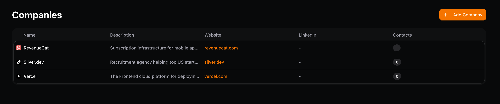
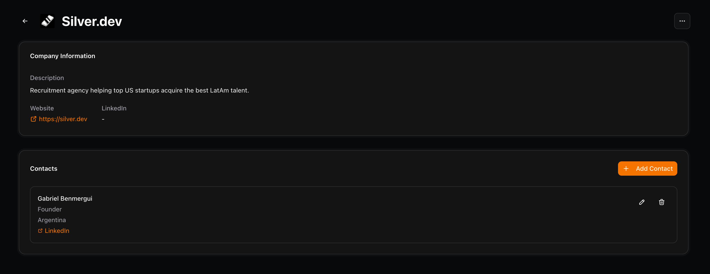
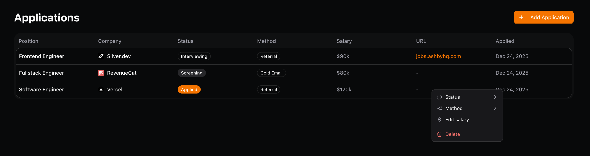
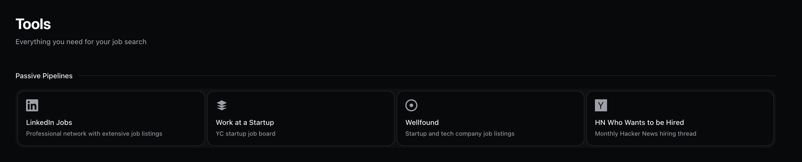

<p align="center">
  
</p>

<p align="center">
    Your personal job tracking dashboard.
    <br />
    <br />
    <a href="#introduction"><strong>Introduction</strong></a> ·
    <a href="#features"><strong>Features</strong></a> ·
    <a href="#tech-stack"><strong>Tech Stack</strong></a> ·
    <a href="#roadmap"><strong>Roadmap</strong></a> ·
    <a href="#getting-started"><strong>Getting Started</strong></a> ·
    <a href="#contributing"><strong>Contributing</strong></a>
</p>

<br/>

> [!NOTE]
> This is a work-in-progress, built-in-public project. It's not feature complete, may have bugs, and will evolve over time. Feel free to fork if needed. Suggestions are welcome!

## Introduction

Jobes is a personal job tracking dashboard to manage companies, contacts, and application progress. It serves as a single source of truth for your job search, helping you stay organized from initial company research through offer negotiation.

## Features

### Company directory

Track companies you're interested in with notes, career page links, and relevant information to inform your job search strategy.



### Contacts

CRM-style tracking of professional connections and referrals. Keep notes on interactions, LinkedIn profiles, and referral potential for each contact.



### Application Tracker

Log every application with status updates, timeline history, and follow-up reminders. Never lose track of where you are in each process.



<!--  -->

### Job Search Toolkit

Curated resources including job boards, ATS optimization tools, and resume builders to support your search.



## Tech Stack

### Framework & Runtime

- [Next.js 16](https://nextjs.org/) · React framework with App Router
- [React 19](https://react.dev/) · UI library
- [Bun](https://bun.sh/) · JavaScript runtime and package manager

### UI & Styling

- [Tailwind CSS v4](https://tailwindcss.com/) · utility-first CSS
- [shadcn/ui](https://ui.shadcn.com/) · component library
- [Radix UI](https://www.radix-ui.com/) · accessible primitives
- [Tabler Icons](https://tabler.io/icons) · icon set

### Data & State

- [Effect](https://effect.website/) · typed functional programming for services
- [TanStack Query](https://tanstack.com/query) · async state management
- [TanStack Table](https://tanstack.com/table) · headless table utilities
- [React Hook Form](https://react-hook-form.com/) · form handling
- [Zod](https://zod.dev/) · schema validation

### Developer Experience

- [TypeScript](https://www.typescriptlang.org/) · type safety
- [Vitest](https://vitest.dev/) · testing framework
- [ESLint](https://eslint.org/) · linting
- [Prettier](https://prettier.io/) · code formatting

## Roadmap

There are plans to continue developing features, such as:

- [x] Company directory with basic operations
- [ ] Contact management system (in progress)
- [ ] Application tracker with status pipeline (in progress)
- [ ] Data export/import functionality
- [ ] Cloud sync (optionally authenticate to save)

## Getting Started

### Prerequisites

- [Bun](https://bun.sh/) (v1.0 or higher)

### Installation

1. Clone the repository

```bash
git clone https://github.com/yourusername/jobes.git
cd jobes
```

2. Install dependencies

```bash
bun install
```

3. Start the development server

```bash
bun dev
```

4. Open [http://localhost:3000](http://localhost:3000) in your browser

### Available Scripts

```bash
bun dev          # Start development server
bun run build    # Build for production
bun run lint     # Run ESLint
bun test         # Run tests
bun run typecheck # Type check without emitting
```

## Contributing

Contributions are welcome! To ensure we can incorporate your work smoothly:

1. **Open an issue first**: Before starting work on a new feature or significant change, please [open an issue](https://github.com/yourusername/jobes/issues) to discuss it. This helps avoid duplicate effort and ensures the feature aligns with the project direction.

2. **Fork and branch**: Fork the repository and create a feature branch from `main`.

3. **Submit a PR**: Once your changes are ready, open a pull request with a clear description of what you've done.

## License

[MIT](LICENSE)
